# mohdzain.com — Project Onboarding Guide

_Generated automatically by GNOST._

## Project Overview

- **Root:** `/Users/mohdzain/Documents/GitHub/mohdzain.com`
- **Languages:** javascript (39)
- **Framework:** Not detected

## Entry Points

- `src/index.js` — Common JS entry filename
- `src/App.js` — Common JS entry filename

## Execution Flow (High Level)

- `src/App.js` → `src/components/Bars/Topbar.js`
- `src/App.js` → `src/pages/Blogs.js`
- `src/App.js` → `src/components/ui/ScrollToTop.js`
- `src/App.js` → `src/components/ui/Navbar.js`
- `src/App.js` → `src/pages/Allprojects.js` → `src/config/allproject.js`

_(52 additional paths omitted for clarity.)_

## Execution Flow Diagram

```mermaid
flowchart TD
  src_pages_home_components_Projects_js --> src_config_allproject_js
  src_pages_blogs_cryptosystem_CimagesCrypt_js --> src_pages_blogs_cryptosystem_References_js
  src_App_js --> src_pages_home_Home_js
  src_pages_blogs_cryptosystem_CimagesCrypt_js --> src_pages_blogs_cryptosystem_Conclusion_js
  src_pages_home_components_Skills_js --> src_components_Bars_SegmentedProgressBar_js
  src_pages_home_Home_js --> src_pages_home_components_Projects_js
  src_pages_home_components_Exp_js --> src_components_layout_Ribbon_js
  src_pages_blogs_cryptosystem_CimagesCrypt_js --> src_pages_blogs_cryptosystem_Encryption_js
  src_pages_blogs_cryptosystem_CimagesCrypt_js --> src_pages_blogs_cryptosystem_Decryption_js
  src_pages_home_components_Skills_js --> src_components_layout_Ribbon_js
  src_pages_home_Home_js --> src_pages_home_components_Achivements_js
  src_pages_blogs_cryptosystem_CimagesCrypt_js --> src_pages_blogs_cryptosystem_Results_js
  src_pages_home_Home_js --> src_pages_home_components_Footer_js
  src_pages_home_Home_js --> src_pages_home_components_Head_js
  src_App_js --> src_components_ui_Navbar_js
  src_App_js --> src_components_Bars_Topbar_js
  src_App_js --> src_pages_Gitrepos_js
  src_pages_home_Home_js --> src_pages_home_components_Research_js
  src_pages_home_components_Careerpath_js --> src_components_layout_Ribbon_js
  src_pages_home_Home_js --> src_pages_home_components_Skills2_js
  src_App_js --> src_pages_Allprojects_js
  src_pages_home_components_Research_js --> src_components_layout_Ribbon_js
  src_pages_Allprojects_js --> src_config_allproject_js
  src_pages_home_components_Projects_js --> src_components_layout_Ribbon_js
  src_pages_home_Home_js --> src_pages_home_components_Skills_js
  src_pages_home_components_Exp_js --> src_config_allexp_js
  src_index_js --> src_App_js
  src_pages_home_components_Skills_js --> src_components_Bars_ProgressBar_js
  src_pages_home_Home_js --> src_pages_home_components_Careerpath_js
  src_pages_home_components_Head_js --> src_components_layout_TypingEffect_js
  src_pages_home_Home_js --> src_pages_home_components_Intro_js
  src_App_js --> src_components_ui_ScrollToTop_js
  src_pages_home_components_Skills_js --> src_components_Bars_CPBar_js
  src_pages_home_components_Achivements_js --> src_components_layout_Ribbon_js
  src_pages_home_components_Skills2_js --> src_components_layout_Ribbon_js
  src_pages_home_Home_js --> src_pages_home_components_Exp_js
  src_pages_home_Home_js --> src_pages_home_components_Social_js
  src_App_js --> src_pages_Blogs_js
  src_index_js --> src_reportWebVitals_js
  src_App_js --> src_pages_blogs_cryptosystem_CimagesCrypt_js
  src_pages_home_components_Skills_js --> src_components_Bars_Vertical_js
  src_pages_Gitrepos_js --> src_config_allrepos_js
  src_pages_home_components_Intro_js --> src_components_layout_Ribbon_js
```

## Recommended Reading Order

### Start Here

- `src/App.js`
- `src/index.js`

### Core Logic

- `src/App.js`
- `src/pages/Allprojects.js`
- `src/pages/Gitrepos.js`
- `src/pages/blogs/cryptosystem/CimagesCrypt.js`
- `src/pages/home/Home.js`
- `src/pages/home/components/Achivements.js`
- `src/pages/home/components/Careerpath.js`
- `src/pages/home/components/Exp.js`
- `src/pages/home/components/Head.js`
- `src/pages/home/components/Intro.js`
- `src/pages/home/components/Projects.js`
- `src/pages/home/components/Research.js`
- `src/pages/home/components/Skills.js`
- `src/pages/home/components/Skills2.js`

### Supporting / Leaf Code

- `src/components/Bars/CPBar.js`
- `src/components/Bars/ProgressBar.js`
- `src/components/Bars/SegmentedProgressBar.js`
- `src/components/Bars/Topbar.js`
- `src/components/Bars/Vertical.js`
- `src/components/layout/Ribbon.js`
- `src/components/layout/TypingEffect.js`
- `src/components/ui/Navbar.js`
- `src/components/ui/ScrollToTop.js`
- `src/config/allexp.js`
- `src/config/allproject.js`
- `src/config/allrepos.js`
- `src/pages/Blogs.js`
- `src/pages/blogs/cryptosystem/Conclusion.js`
- `src/pages/blogs/cryptosystem/Decryption.js`
- `src/pages/blogs/cryptosystem/Encryption.js`
- `src/pages/blogs/cryptosystem/References.js`
- `src/pages/blogs/cryptosystem/Results.js`
- `src/pages/home/components/Footer.js`
- `src/pages/home/components/Social.js`
- `src/reportWebVitals.js`
