# mohdzain.com — Project Onboarding Guide

_Generated automatically by <a href='https://gnost.readthedocs.io'>GNOST</a>._

## Project Overview

- **Root:** `/Users/mohdzain/Documents/GitHub/mohdzain.com`
- **Languages:** javascript (47)
- **Framework:** Not detected

## Entry Points

- `src/index.js` — Common JS entry filename
- `src/App.js` — Common JS entry filename

## Execution Flow (High Level)

- `src/index.js` → `src/reportWebVitals.js`
- `src/index.js` → `src/App.js` → `src/components/ui/ScrollToTop.js`
- `src/index.js` → `src/App.js` → `src/components/Bars/Topbar.js`
- `src/index.js` → `src/App.js` → `src/pages/Gitrepos.js` → `src/config/allrepos.js`
- `src/index.js` → `src/App.js` → `src/components/ui/Navbar.js`

_(86 additional paths omitted for clarity.)_

## Execution Flow (Overview)

```mermaid
flowchart TD
  src_pages_home_Home_js --> src_pages_home_components_Intro_js
  src_pages_home_Home_js --> src_pages_home_components_Skills_js
  src_App_js --> src_pages_Allprojects_js
  src_pages_blogs_blogRegistry_js --> src_pages_blogs_tracing_TracingExample_js
  src_pages_home_Home_js --> src_pages_home_components_Careerpath_js
  src_pages_blogs_AllExample_js --> src_pages_blogs_blogRegistry_js
  src_pages_blogs_blogRegistry_js --> src_pages_blogs_cryptosystem_CimagesCrypt_js
  src_App_js --> src_pages_blogs_AllBlogs_js
  src_pages_home_Home_js --> src_pages_home_components_Achivements_js
  src_pages_blogs_AllBlogs_js --> src_pages_blogs_blogRegistry_js
  src_pages_home_Home_js --> src_pages_home_components_Skills2_js
  src_App_js --> src_pages_Blogs_js
  src_App_js --> src_pages_blogs_AllExample_js
  src_App_js --> src_pages_home_Home_js
  src_index_js --> src_App_js
  src_pages_home_Home_js --> src_pages_home_components_Head_js
  src_App_js --> src_pages_Gitrepos_js
  src_pages_home_Home_js --> src_pages_home_components_Exp_js
  src_pages_home_Home_js --> src_pages_home_components_Projects_js
  src_pages_home_Home_js --> src_pages_home_components_Research_js
  src_pages_blogs_blogRegistry_js --> src_pages_blogs_tracing_LLMTracing_js
  src_pages_Blogs_js --> src_pages_blogs_blogRegistry_js
```

> 📌 This diagram shows the high-level execution flow. For the complete flow, see [**flow/flow-full.md**](./flow/FLOW-full.md) Raw Mermaid: [flow/flow-full.mmd](./flow/FLOW-full.mmd)

## Recommended Reading Order

### Start Here

- `src/App.js`
- `src/index.js`

### Core Logic

- `src/App.js`
- `src/pages/Allprojects.js`
- `src/pages/Blogs.js`
- `src/pages/Gitrepos.js`
- `src/pages/blogs/AllBlogs.js`
- `src/pages/blogs/AllExample.js`
- `src/pages/blogs/blogRegistry.js`
- `src/pages/blogs/cryptosystem/CimagesCrypt.js`
- `src/pages/blogs/tracing/LLMTracing.js`
- `src/pages/blogs/tracing/TracingExample.js`
- `src/pages/home/Home.js`
- `src/pages/home/components/Achivements.js`
- `src/pages/home/components/Careerpath.js`
- `src/pages/home/components/Exp.js`
- `src/pages/home/components/Head.js`
- `src/pages/home/components/Intro.js`
- `src/pages/home/components/Projects.js`
- `src/pages/home/components/Research.js`
- `src/pages/home/components/Skills.js`
- `src/pages/home/components/Skills2.js`

### Supporting / Leaf Code

- `src/components/Bars/CPBar.js`
- `src/components/Bars/ProgressBar.js`
- `src/components/Bars/SegmentedProgressBar.js`
- `src/components/Bars/Topbar.js`
- `src/components/Bars/Vertical.js`
- `src/components/layout/CodeBlock.js`
- `src/components/layout/Ribbon.js`
- `src/components/layout/TypingEffect.js`
- `src/components/ui/Navbar.js`
- `src/components/ui/ScrollToTop.js`
- `src/config/allexp.js`
- `src/config/allproject.js`
- `src/config/allrepos.js`
- `src/pages/Gnost.js`
- `src/pages/Wrong.js`
- `src/pages/blogs/cryptosystem/Conclusion.js`
- `src/pages/blogs/cryptosystem/Decryption.js`
- `src/pages/blogs/cryptosystem/Encryption.js`
- `src/pages/blogs/cryptosystem/References.js`
- `src/pages/blogs/cryptosystem/Results.js`
- `src/pages/home/components/Footer.js`
- `src/pages/home/components/Social.js`
- `src/reportWebVitals.js`

## 📘 First Files to Read
- **`mohdzain.com/src/App.js`**
  - Primary entry point into the application
- **`mohdzain.com/src/index.js`**
  - Primary entry point into the application
- **`pages/home/Home.js`**
  - Core logic file referenced by multiple execution paths
- **`pages/blogs/blogRegistry.js`**
  - Core logic file referenced by multiple execution paths
- **`pages/blogs/AllExample.js`**
  - Core logic file referenced by multiple execution paths
- **`pages/blogs/AllBlogs.js`**
  - Core logic file referenced by multiple execution paths
- **`src/pages/Blogs.js`**
  - Core logic file referenced by multiple execution paths
- **`home/components/Skills.js`**
  - Core logic file referenced by multiple execution paths
- **`src/pages/Gitrepos.js`**
  - Core logic file referenced by multiple execution paths
- **`src/pages/Allprojects.js`**
  - Core logic file referenced by multiple execution paths

## ⚠️ Caution Areas
### `components/layout/Ribbon.js`
- **Type:** high_impact
- **Severity:** 5
- Many files depend on this module
### `mohdzain.com/src/App.js`
- **Type:** tight_coupling
- **Severity:** 3
- File has a high number of dependencies
### `pages/home/Home.js`
- **Type:** tight_coupling
- **Severity:** 3
- File has a high number of dependencies
### `blogs/cryptosystem/Results.js`
- **Type:** tight_coupling
- **Severity:** 5
- File has a high number of dependencies
### `blogs/cryptosystem/CimagesCrypt.js`
- **Type:** tight_coupling
- **Severity:** 5
- File has a high number of dependencies
## Key Execution Paths

To understand specific scenarios, see the entry-based execution paths:

- 📍 [Entry-based Paths](flow/entry-paths.md)

- 🧭 [folder-based Paths](flow/folder-paths.md)

(Complete system flow: [flow/flow-full.md](flow/FLOW-full.md))
