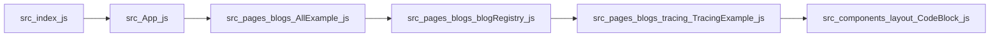
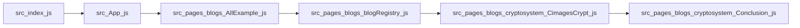
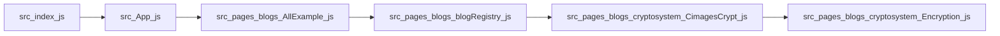

# Entry-based Execution Paths

These diagrams show individual execution paths starting from application entry points. Each path represents one possible flow through the system.

## Path 1 — `src/index.js`

**Execution chain:** src/index.js → src/App.js → src/pages/blogs/AllExample.js → src/pages/blogs/blogRegistry.js → src/pages/blogs/tracing/TracingExample.js → src/components/layout/CodeBlock.js

## Path 2 — `src/index.js`

**Execution chain:** src/index.js → src/App.js → src/pages/blogs/AllExample.js → src/pages/blogs/blogRegistry.js → src/pages/blogs/cryptosystem/CimagesCrypt.js → src/pages/blogs/cryptosystem/Conclusion.js

## Path 3 — `src/index.js`

**Execution chain:** src/index.js → src/App.js → src/pages/blogs/AllExample.js → src/pages/blogs/blogRegistry.js → src/pages/blogs/cryptosystem/CimagesCrypt.js → src/pages/blogs/cryptosystem/Encryption.js
