# Keyword-based Execution Paths

These diagrams show execution flows related to key features, auto-detected from the project structure.

## Feature: `bars`

### Representative Paths

#### Path Group 1

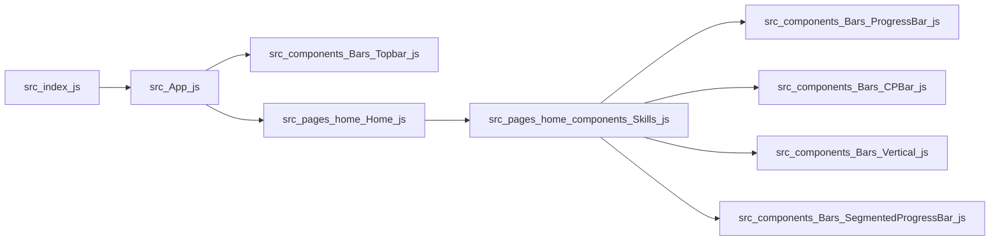
**Execution chain:** src/App.js → src/pages/Gnost.js

#### Path Group 2

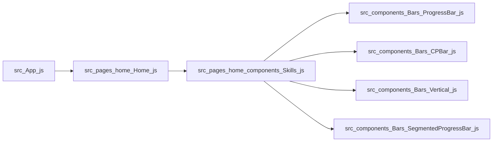
**Execution chain:** src/App.js → src/pages/Gnost.js

### Combined Flow (All `bars` Paths)


## Feature: `blogs`

### Representative Paths

#### Path Group 1

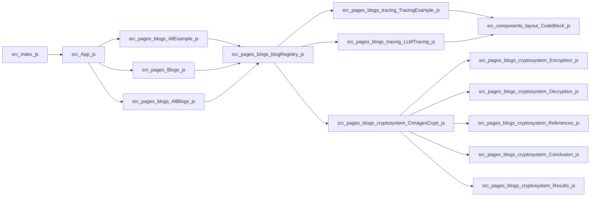
**Execution chain:** src/App.js → src/pages/Gnost.js

#### Path Group 2

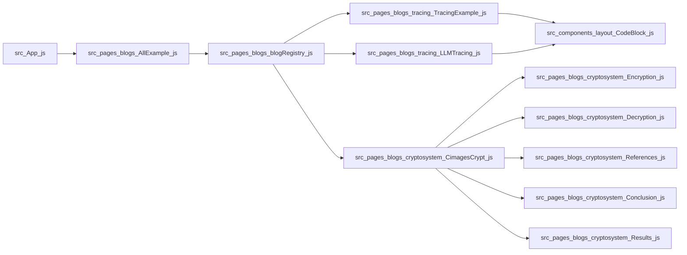
**Execution chain:** src/App.js → src/pages/Gnost.js

### Combined Flow (All `blogs` Paths)


## Feature: `components`

### Representative Paths

#### Path Group 1

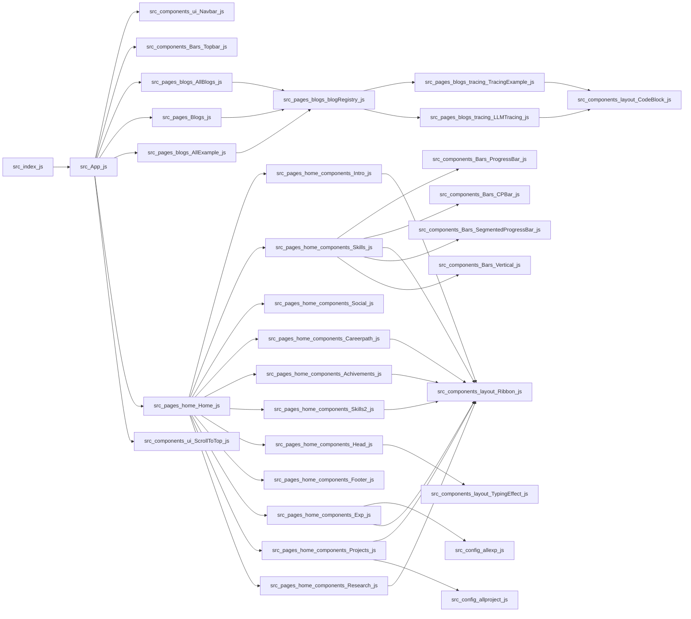
**Execution chain:** src/App.js → src/pages/Gnost.js

#### Path Group 2

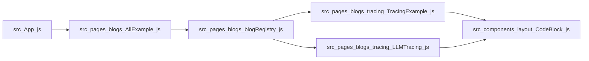
**Execution chain:** src/App.js → src/pages/Gnost.js

### Combined Flow (All `components` Paths)


## Feature: `conf`

### Representative Paths

#### Path Group 1

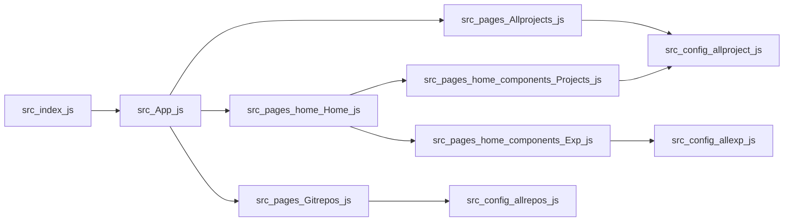
**Execution chain:** src/App.js → src/pages/Gnost.js

#### Path Group 2

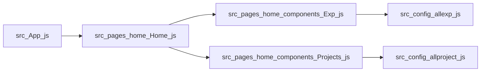
**Execution chain:** src/App.js → src/pages/Gnost.js

### Combined Flow (All `conf` Paths)


## Feature: `example`

### Representative Paths

#### Path Group 1


**Execution chain:** src/App.js → src/pages/Gnost.js

#### Path Group 2


**Execution chain:** src/App.js → src/pages/Gnost.js

### Combined Flow (All `example` Paths)


## Feature: `home`

### Representative Paths

#### Path Group 1

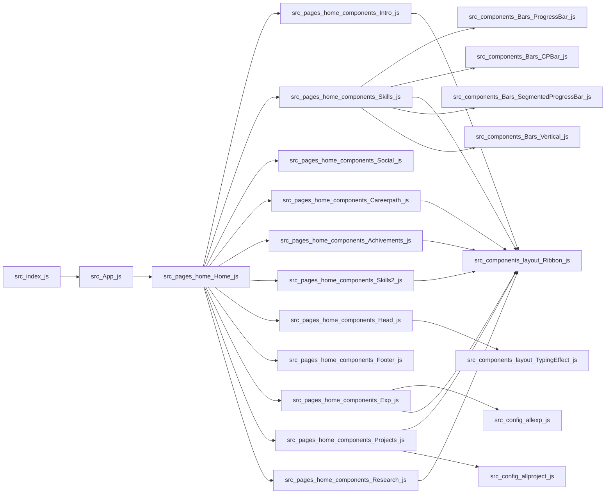
**Execution chain:** src/App.js → src/pages/Gnost.js

#### Path Group 2

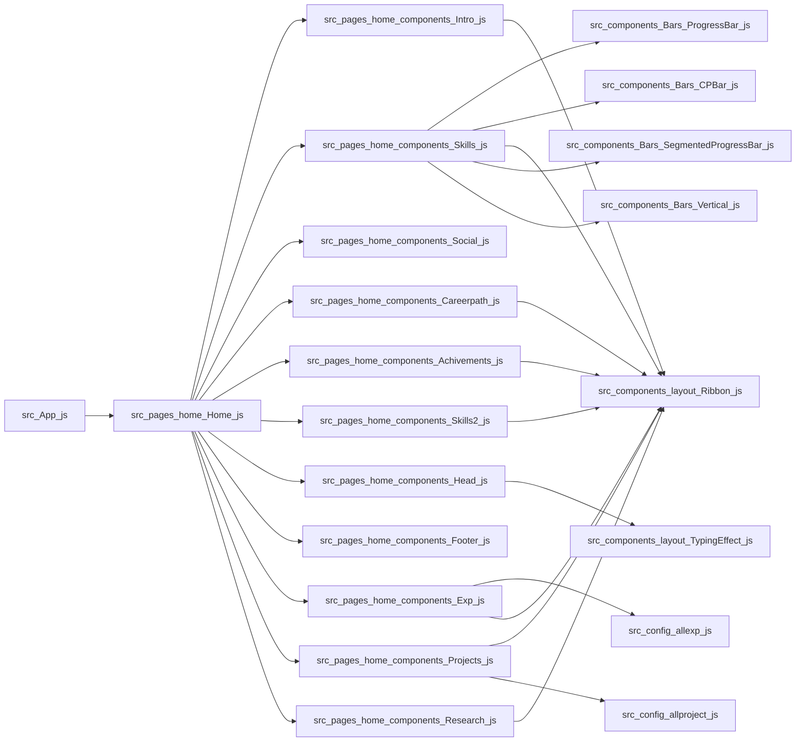
**Execution chain:** src/App.js → src/pages/Gnost.js

### Combined Flow (All `home` Paths)


## Feature: `layout`

### Representative Paths

#### Path Group 1

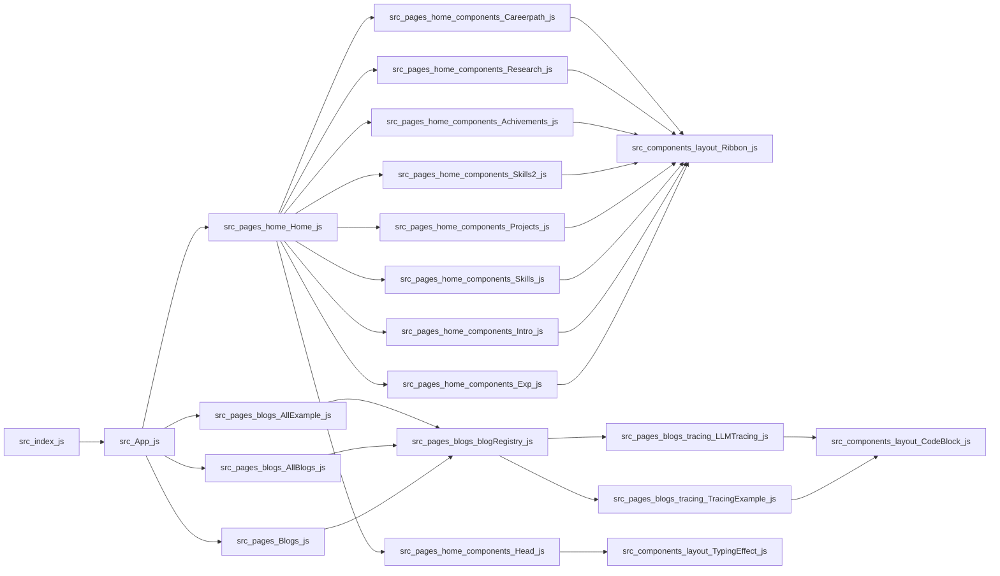
**Execution chain:** src/App.js → src/pages/Gnost.js

#### Path Group 2


**Execution chain:** src/App.js → src/pages/Gnost.js

### Combined Flow (All `layout` Paths)

```mermaid
flowchart LR
  src_pages_home_components_Careerpath_js --> src_components_layout_Ribbon_js
  src_pages_home_Home_js --> src_pages_home_components_Intro_js
  src_pages_home_components_Research_js --> src_components_layout_Ribbon_js
  src_pages_home_Home_js --> src_pages_home_components_Skills_js
  src_pages_home_components_Achivements_js --> src_components_layout_Ribbon_js
  src_pages_blogs_blogRegistry_js --> src_pages_blogs_tracing_TracingExample_js
  src_pages_home_components_Skills2_js --> src_components_layout_Ribbon_js
  src_pages_home_Home_js --> src_pages_home_components_Careerpath_js
  src_pages_blogs_AllExample_js --> src_pages_blogs_blogRegistry_js
  src_App_js --> src_pages_blogs_AllBlogs_js
  src_pages_blogs_tracing_LLMTracing_js --> src_components_layout_CodeBlock_js
  src_pages_home_Home_js --> src_pages_home_components_Achivements_js
  src_pages_blogs_AllBlogs_js --> src_pages_blogs_blogRegistry_js
  src_pages_home_Home_js --> src_pages_home_components_Skills2_js
  src_App_js --> src_pages_Blogs_js
  src_pages_home_components_Projects_js --> src_components_layout_Ribbon_js
  src_App_js --> src_pages_blogs_AllExample_js
  src_pages_home_components_Skills_js --> src_components_layout_Ribbon_js
  src_pages_home_components_Intro_js --> src_components_layout_Ribbon_js
  src_pages_home_components_Exp_js --> src_components_layout_Ribbon_js
  src_App_js --> src_pages_home_Home_js
  src_index_js --> src_App_js
  src_pages_home_Home_js --> src_pages_home_components_Head_js
  src_pages_home_Home_js --> src_pages_home_components_Exp_js
  src_pages_home_Home_js --> src_pages_home_components_Projects_js
  src_pages_home_Home_js --> src_pages_home_components_Research_js
  src_pages_blogs_blogRegistry_js --> src_pages_blogs_tracing_LLMTracing_js
  src_pages_blogs_tracing_TracingExample_js --> src_components_layout_CodeBlock_js
  src_pages_Blogs_js --> src_pages_blogs_blogRegistry_js
  src_pages_home_components_Head_js --> src_components_layout_TypingEffect_js
```

## Feature: `logs`

### Representative Paths

#### Path Group 1

```mermaid
flowchart LR
  src_pages_blogs_cryptosystem_CimagesCrypt_js --> src_pages_blogs_cryptosystem_Encryption_js
  src_pages_blogs_cryptosystem_CimagesCrypt_js --> src_pages_blogs_cryptosystem_Decryption_js
  src_App_js --> src_pages_Blogs_js
  src_App_js --> src_pages_blogs_AllExample_js
  src_pages_blogs_blogRegistry_js --> src_pages_blogs_tracing_LLMTracing_js
  src_pages_blogs_cryptosystem_CimagesCrypt_js --> src_pages_blogs_cryptosystem_References_js
  src_pages_blogs_cryptosystem_CimagesCrypt_js --> src_pages_blogs_cryptosystem_Conclusion_js
  src_pages_blogs_AllExample_js --> src_pages_blogs_blogRegistry_js
  src_pages_blogs_blogRegistry_js --> src_pages_blogs_cryptosystem_CimagesCrypt_js
  src_App_js --> src_pages_blogs_AllBlogs_js
  src_pages_blogs_tracing_TracingExample_js --> src_components_layout_CodeBlock_js
  src_pages_blogs_tracing_LLMTracing_js --> src_components_layout_CodeBlock_js
  src_pages_Blogs_js --> src_pages_blogs_blogRegistry_js
  src_pages_blogs_AllBlogs_js --> src_pages_blogs_blogRegistry_js
  src_pages_blogs_blogRegistry_js --> src_pages_blogs_tracing_TracingExample_js
  src_index_js --> src_App_js
  src_pages_blogs_cryptosystem_CimagesCrypt_js --> src_pages_blogs_cryptosystem_Results_js
```
**Execution chain:** src/App.js → src/pages/Gnost.js

#### Path Group 2

```mermaid
flowchart LR
  src_pages_blogs_cryptosystem_CimagesCrypt_js --> src_pages_blogs_cryptosystem_Encryption_js
  src_pages_blogs_cryptosystem_CimagesCrypt_js --> src_pages_blogs_cryptosystem_Decryption_js
  src_App_js --> src_pages_blogs_AllExample_js
  src_pages_blogs_blogRegistry_js --> src_pages_blogs_tracing_LLMTracing_js
  src_pages_blogs_cryptosystem_CimagesCrypt_js --> src_pages_blogs_cryptosystem_References_js
  src_pages_blogs_cryptosystem_CimagesCrypt_js --> src_pages_blogs_cryptosystem_Conclusion_js
  src_pages_blogs_AllExample_js --> src_pages_blogs_blogRegistry_js
  src_pages_blogs_blogRegistry_js --> src_pages_blogs_cryptosystem_CimagesCrypt_js
  src_pages_blogs_tracing_TracingExample_js --> src_components_layout_CodeBlock_js
  src_pages_blogs_tracing_LLMTracing_js --> src_components_layout_CodeBlock_js
  src_pages_blogs_blogRegistry_js --> src_pages_blogs_tracing_TracingExample_js
  src_pages_blogs_cryptosystem_CimagesCrypt_js --> src_pages_blogs_cryptosystem_Results_js
```
**Execution chain:** src/App.js → src/pages/Gnost.js

### Combined Flow (All `logs` Paths)

```mermaid
flowchart LR
  src_pages_blogs_cryptosystem_CimagesCrypt_js --> src_pages_blogs_cryptosystem_Encryption_js
  src_pages_blogs_cryptosystem_CimagesCrypt_js --> src_pages_blogs_cryptosystem_Decryption_js
  src_App_js --> src_pages_Blogs_js
  src_App_js --> src_pages_blogs_AllExample_js
  src_pages_blogs_blogRegistry_js --> src_pages_blogs_tracing_LLMTracing_js
  src_pages_blogs_cryptosystem_CimagesCrypt_js --> src_pages_blogs_cryptosystem_References_js
  src_pages_blogs_cryptosystem_CimagesCrypt_js --> src_pages_blogs_cryptosystem_Conclusion_js
  src_pages_blogs_AllExample_js --> src_pages_blogs_blogRegistry_js
  src_pages_blogs_blogRegistry_js --> src_pages_blogs_cryptosystem_CimagesCrypt_js
  src_App_js --> src_pages_blogs_AllBlogs_js
  src_pages_blogs_tracing_TracingExample_js --> src_components_layout_CodeBlock_js
  src_pages_blogs_tracing_LLMTracing_js --> src_components_layout_CodeBlock_js
  src_pages_Blogs_js --> src_pages_blogs_blogRegistry_js
  src_pages_blogs_AllBlogs_js --> src_pages_blogs_blogRegistry_js
  src_pages_blogs_blogRegistry_js --> src_pages_blogs_tracing_TracingExample_js
  src_index_js --> src_App_js
  src_pages_blogs_cryptosystem_CimagesCrypt_js --> src_pages_blogs_cryptosystem_Results_js
```

## Feature: `out`

### Representative Paths

#### Path Group 1

```mermaid
flowchart LR
  src_pages_home_components_Careerpath_js --> src_components_layout_Ribbon_js
  src_pages_home_Home_js --> src_pages_home_components_Intro_js
  src_pages_home_components_Research_js --> src_components_layout_Ribbon_js
  src_pages_home_Home_js --> src_pages_home_components_Skills_js
  src_pages_home_components_Achivements_js --> src_components_layout_Ribbon_js
  src_pages_blogs_blogRegistry_js --> src_pages_blogs_tracing_TracingExample_js
  src_pages_home_components_Skills2_js --> src_components_layout_Ribbon_js
  src_pages_home_Home_js --> src_pages_home_components_Careerpath_js
  src_pages_blogs_AllExample_js --> src_pages_blogs_blogRegistry_js
  src_App_js --> src_pages_blogs_AllBlogs_js
  src_pages_blogs_tracing_LLMTracing_js --> src_components_layout_CodeBlock_js
  src_pages_home_Home_js --> src_pages_home_components_Achivements_js
  src_pages_blogs_AllBlogs_js --> src_pages_blogs_blogRegistry_js
  src_pages_home_Home_js --> src_pages_home_components_Skills2_js
  src_App_js --> src_pages_Blogs_js
  src_pages_home_components_Projects_js --> src_components_layout_Ribbon_js
  src_App_js --> src_pages_blogs_AllExample_js
  src_pages_home_components_Skills_js --> src_components_layout_Ribbon_js
  src_pages_home_components_Intro_js --> src_components_layout_Ribbon_js
  src_pages_home_components_Exp_js --> src_components_layout_Ribbon_js
  src_App_js --> src_pages_home_Home_js
  src_index_js --> src_App_js
  src_pages_home_Home_js --> src_pages_home_components_Head_js
  src_pages_home_Home_js --> src_pages_home_components_Exp_js
  src_pages_home_Home_js --> src_pages_home_components_Projects_js
  src_pages_home_Home_js --> src_pages_home_components_Research_js
  src_pages_blogs_blogRegistry_js --> src_pages_blogs_tracing_LLMTracing_js
  src_pages_blogs_tracing_TracingExample_js --> src_components_layout_CodeBlock_js
  src_pages_Blogs_js --> src_pages_blogs_blogRegistry_js
  src_pages_home_components_Head_js --> src_components_layout_TypingEffect_js
```
**Execution chain:** src/App.js → src/pages/Gnost.js

#### Path Group 2

```mermaid
flowchart LR
  src_App_js --> src_pages_blogs_AllExample_js
  src_pages_blogs_blogRegistry_js --> src_pages_blogs_tracing_LLMTracing_js
  src_pages_blogs_AllExample_js --> src_pages_blogs_blogRegistry_js
  src_pages_blogs_tracing_TracingExample_js --> src_components_layout_CodeBlock_js
  src_pages_blogs_tracing_LLMTracing_js --> src_components_layout_CodeBlock_js
  src_pages_blogs_blogRegistry_js --> src_pages_blogs_tracing_TracingExample_js
```
**Execution chain:** src/App.js → src/pages/Gnost.js

### Combined Flow (All `out` Paths)

```mermaid
flowchart LR
  src_pages_home_components_Careerpath_js --> src_components_layout_Ribbon_js
  src_pages_home_Home_js --> src_pages_home_components_Intro_js
  src_pages_home_components_Research_js --> src_components_layout_Ribbon_js
  src_pages_home_Home_js --> src_pages_home_components_Skills_js
  src_pages_home_components_Achivements_js --> src_components_layout_Ribbon_js
  src_pages_blogs_blogRegistry_js --> src_pages_blogs_tracing_TracingExample_js
  src_pages_home_components_Skills2_js --> src_components_layout_Ribbon_js
  src_pages_home_Home_js --> src_pages_home_components_Careerpath_js
  src_pages_blogs_AllExample_js --> src_pages_blogs_blogRegistry_js
  src_App_js --> src_pages_blogs_AllBlogs_js
  src_pages_blogs_tracing_LLMTracing_js --> src_components_layout_CodeBlock_js
  src_pages_home_Home_js --> src_pages_home_components_Achivements_js
  src_pages_blogs_AllBlogs_js --> src_pages_blogs_blogRegistry_js
  src_pages_home_Home_js --> src_pages_home_components_Skills2_js
  src_App_js --> src_pages_Blogs_js
  src_pages_home_components_Projects_js --> src_components_layout_Ribbon_js
  src_App_js --> src_pages_blogs_AllExample_js
  src_pages_home_components_Skills_js --> src_components_layout_Ribbon_js
  src_pages_home_components_Intro_js --> src_components_layout_Ribbon_js
  src_pages_home_components_Exp_js --> src_components_layout_Ribbon_js
  src_App_js --> src_pages_home_Home_js
  src_index_js --> src_App_js
  src_pages_home_Home_js --> src_pages_home_components_Head_js
  src_pages_home_Home_js --> src_pages_home_components_Exp_js
  src_pages_home_Home_js --> src_pages_home_components_Projects_js
  src_pages_home_Home_js --> src_pages_home_components_Research_js
  src_pages_blogs_blogRegistry_js --> src_pages_blogs_tracing_LLMTracing_js
  src_pages_blogs_tracing_TracingExample_js --> src_components_layout_CodeBlock_js
  src_pages_Blogs_js --> src_pages_blogs_blogRegistry_js
  src_pages_home_components_Head_js --> src_components_layout_TypingEffect_js
```

## Feature: `pages`

### Representative Paths

#### Path Group 1

```mermaid
flowchart LR
  src_pages_home_components_Careerpath_js --> src_components_layout_Ribbon_js
  src_pages_home_components_Skills_js --> src_components_Bars_ProgressBar_js
  src_pages_home_components_Exp_js --> src_config_allexp_js
  src_pages_home_Home_js --> src_pages_home_components_Intro_js
  src_pages_home_components_Research_js --> src_components_layout_Ribbon_js
  src_App_js --> src_pages_Gnost_js
  src_pages_home_Home_js --> src_pages_home_components_Skills_js
  src_pages_home_components_Achivements_js --> src_components_layout_Ribbon_js
  src_App_js --> src_pages_Allprojects_js
  src_pages_blogs_blogRegistry_js --> src_pages_blogs_tracing_TracingExample_js
  src_pages_home_Home_js --> src_pages_home_components_Social_js
  src_pages_Allprojects_js --> src_config_allproject_js
  src_pages_home_components_Skills2_js --> src_components_layout_Ribbon_js
  src_pages_home_Home_js --> src_pages_home_components_Careerpath_js
  src_pages_blogs_cryptosystem_CimagesCrypt_js --> src_pages_blogs_cryptosystem_Conclusion_js
  src_pages_blogs_AllExample_js --> src_pages_blogs_blogRegistry_js
  src_pages_home_components_Skills_js --> src_components_Bars_CPBar_js
  src_pages_blogs_blogRegistry_js --> src_pages_blogs_cryptosystem_CimagesCrypt_js
  src_App_js --> src_pages_blogs_AllBlogs_js
  src_pages_blogs_tracing_LLMTracing_js --> src_components_layout_CodeBlock_js
  src_pages_home_Home_js --> src_pages_home_components_Achivements_js
  src_pages_blogs_AllBlogs_js --> src_pages_blogs_blogRegistry_js
  src_pages_home_Home_js --> src_pages_home_components_Skills2_js
  src_pages_blogs_cryptosystem_CimagesCrypt_js --> src_pages_blogs_cryptosystem_Results_js
  src_pages_blogs_cryptosystem_CimagesCrypt_js --> src_pages_blogs_cryptosystem_Encryption_js
  src_pages_blogs_cryptosystem_CimagesCrypt_js --> src_pages_blogs_cryptosystem_Decryption_js
  src_App_js --> src_pages_Blogs_js
  src_pages_home_components_Projects_js --> src_components_layout_Ribbon_js
  src_App_js --> src_pages_blogs_AllExample_js
  src_pages_home_components_Skills_js --> src_components_layout_Ribbon_js
  src_pages_Gitrepos_js --> src_config_allrepos_js
  src_pages_home_components_Intro_js --> src_components_layout_Ribbon_js
  src_App_js --> src_pages_home_Home_js
  src_pages_home_components_Exp_js --> src_components_layout_Ribbon_js
  src_pages_home_components_Skills_js --> src_components_Bars_SegmentedProgressBar_js
  src_index_js --> src_App_js
  src_pages_home_Home_js --> src_pages_home_components_Head_js
  src_pages_home_Home_js --> src_pages_home_components_Footer_js
  src_App_js --> src_pages_Gitrepos_js
  src_pages_home_Home_js --> src_pages_home_components_Exp_js
  src_pages_home_Home_js --> src_pages_home_components_Projects_js
  src_pages_home_Home_js --> src_pages_home_components_Research_js
  src_pages_blogs_blogRegistry_js --> src_pages_blogs_tracing_LLMTracing_js
  src_pages_home_components_Projects_js --> src_config_allproject_js
  src_pages_blogs_cryptosystem_CimagesCrypt_js --> src_pages_blogs_cryptosystem_References_js
  src_pages_blogs_tracing_TracingExample_js --> src_components_layout_CodeBlock_js
  src_pages_Blogs_js --> src_pages_blogs_blogRegistry_js
  src_pages_home_components_Skills_js --> src_components_Bars_Vertical_js
  src_App_js --> src_pages_Wrong_js
  src_pages_home_components_Head_js --> src_components_layout_TypingEffect_js
```
**Execution chain:** src/App.js → src/pages/Gnost.js

#### Path Group 2

```mermaid
flowchart LR
  src_pages_blogs_cryptosystem_CimagesCrypt_js --> src_pages_blogs_cryptosystem_Encryption_js
  src_pages_blogs_cryptosystem_CimagesCrypt_js --> src_pages_blogs_cryptosystem_Decryption_js
  src_App_js --> src_pages_blogs_AllExample_js
  src_pages_blogs_blogRegistry_js --> src_pages_blogs_tracing_LLMTracing_js
  src_pages_blogs_cryptosystem_CimagesCrypt_js --> src_pages_blogs_cryptosystem_References_js
  src_pages_blogs_cryptosystem_CimagesCrypt_js --> src_pages_blogs_cryptosystem_Conclusion_js
  src_pages_blogs_AllExample_js --> src_pages_blogs_blogRegistry_js
  src_pages_blogs_blogRegistry_js --> src_pages_blogs_cryptosystem_CimagesCrypt_js
  src_pages_blogs_tracing_TracingExample_js --> src_components_layout_CodeBlock_js
  src_pages_blogs_tracing_LLMTracing_js --> src_components_layout_CodeBlock_js
  src_pages_blogs_blogRegistry_js --> src_pages_blogs_tracing_TracingExample_js
  src_pages_blogs_cryptosystem_CimagesCrypt_js --> src_pages_blogs_cryptosystem_Results_js
```
**Execution chain:** src/App.js → src/pages/Gnost.js

### Combined Flow (All `pages` Paths)

```mermaid
flowchart LR
  src_pages_home_components_Careerpath_js --> src_components_layout_Ribbon_js
  src_pages_home_components_Skills_js --> src_components_Bars_ProgressBar_js
  src_pages_home_components_Exp_js --> src_config_allexp_js
  src_pages_home_Home_js --> src_pages_home_components_Intro_js
  src_pages_home_components_Research_js --> src_components_layout_Ribbon_js
  src_App_js --> src_pages_Gnost_js
  src_pages_home_Home_js --> src_pages_home_components_Skills_js
  src_pages_home_components_Achivements_js --> src_components_layout_Ribbon_js
  src_App_js --> src_pages_Allprojects_js
  src_pages_blogs_blogRegistry_js --> src_pages_blogs_tracing_TracingExample_js
  src_pages_home_Home_js --> src_pages_home_components_Social_js
  src_pages_Allprojects_js --> src_config_allproject_js
  src_pages_home_components_Skills2_js --> src_components_layout_Ribbon_js
  src_pages_home_Home_js --> src_pages_home_components_Careerpath_js
  src_pages_blogs_cryptosystem_CimagesCrypt_js --> src_pages_blogs_cryptosystem_Conclusion_js
  src_pages_blogs_AllExample_js --> src_pages_blogs_blogRegistry_js
  src_pages_home_components_Skills_js --> src_components_Bars_CPBar_js
  src_pages_blogs_blogRegistry_js --> src_pages_blogs_cryptosystem_CimagesCrypt_js
  src_App_js --> src_pages_blogs_AllBlogs_js
  src_pages_blogs_tracing_LLMTracing_js --> src_components_layout_CodeBlock_js
  src_pages_home_Home_js --> src_pages_home_components_Achivements_js
  src_pages_blogs_AllBlogs_js --> src_pages_blogs_blogRegistry_js
  src_pages_home_Home_js --> src_pages_home_components_Skills2_js
  src_pages_blogs_cryptosystem_CimagesCrypt_js --> src_pages_blogs_cryptosystem_Results_js
  src_pages_blogs_cryptosystem_CimagesCrypt_js --> src_pages_blogs_cryptosystem_Encryption_js
  src_pages_blogs_cryptosystem_CimagesCrypt_js --> src_pages_blogs_cryptosystem_Decryption_js
  src_App_js --> src_pages_Blogs_js
  src_pages_home_components_Projects_js --> src_components_layout_Ribbon_js
  src_App_js --> src_pages_blogs_AllExample_js
  src_pages_home_components_Skills_js --> src_components_layout_Ribbon_js
  src_pages_Gitrepos_js --> src_config_allrepos_js
  src_pages_home_components_Intro_js --> src_components_layout_Ribbon_js
  src_App_js --> src_pages_home_Home_js
  src_pages_home_components_Exp_js --> src_components_layout_Ribbon_js
  src_pages_home_components_Skills_js --> src_components_Bars_SegmentedProgressBar_js
  src_index_js --> src_App_js
  src_pages_home_Home_js --> src_pages_home_components_Head_js
  src_pages_home_Home_js --> src_pages_home_components_Footer_js
  src_App_js --> src_pages_Gitrepos_js
  src_pages_home_Home_js --> src_pages_home_components_Exp_js
  src_pages_home_Home_js --> src_pages_home_components_Projects_js
  src_pages_home_Home_js --> src_pages_home_components_Research_js
  src_pages_blogs_blogRegistry_js --> src_pages_blogs_tracing_LLMTracing_js
  src_pages_home_components_Projects_js --> src_config_allproject_js
  src_pages_blogs_cryptosystem_CimagesCrypt_js --> src_pages_blogs_cryptosystem_References_js
  src_pages_blogs_tracing_TracingExample_js --> src_components_layout_CodeBlock_js
  src_pages_Blogs_js --> src_pages_blogs_blogRegistry_js
  src_pages_home_components_Skills_js --> src_components_Bars_Vertical_js
  src_App_js --> src_pages_Wrong_js
  src_pages_home_components_Head_js --> src_components_layout_TypingEffect_js
```

## Feature: `projects`

### Representative Paths

#### Path Group 1

```mermaid
flowchart LR
  src_pages_Allprojects_js --> src_config_allproject_js
  src_pages_home_components_Projects_js --> src_components_layout_Ribbon_js
  src_pages_home_Home_js --> src_pages_home_components_Projects_js
  src_pages_home_components_Projects_js --> src_config_allproject_js
  src_App_js --> src_pages_Allprojects_js
  src_App_js --> src_pages_home_Home_js
  src_index_js --> src_App_js
```
**Execution chain:** src/App.js → src/pages/Gnost.js

#### Path Group 2

```mermaid
flowchart LR
  src_pages_home_components_Projects_js --> src_components_layout_Ribbon_js
  src_pages_home_components_Projects_js --> src_config_allproject_js
  src_pages_home_Home_js --> src_pages_home_components_Projects_js
  src_App_js --> src_pages_home_Home_js
```
**Execution chain:** src/App.js → src/pages/Gnost.js

### Combined Flow (All `projects` Paths)

```mermaid
flowchart LR
  src_pages_Allprojects_js --> src_config_allproject_js
  src_pages_home_components_Projects_js --> src_components_layout_Ribbon_js
  src_pages_home_Home_js --> src_pages_home_components_Projects_js
  src_pages_home_components_Projects_js --> src_config_allproject_js
  src_App_js --> src_pages_Allprojects_js
  src_App_js --> src_pages_home_Home_js
  src_index_js --> src_App_js
```

## Feature: `reference`

### Representative Paths

#### Path Group 1

```mermaid
flowchart LR
  src_App_js --> src_pages_Blogs_js
  src_App_js --> src_pages_blogs_AllExample_js
  src_pages_blogs_cryptosystem_CimagesCrypt_js --> src_pages_blogs_cryptosystem_References_js
  src_pages_blogs_AllExample_js --> src_pages_blogs_blogRegistry_js
  src_pages_blogs_blogRegistry_js --> src_pages_blogs_cryptosystem_CimagesCrypt_js
  src_App_js --> src_pages_blogs_AllBlogs_js
  src_pages_Blogs_js --> src_pages_blogs_blogRegistry_js
  src_pages_blogs_AllBlogs_js --> src_pages_blogs_blogRegistry_js
  src_index_js --> src_App_js
```
**Execution chain:** src/App.js → src/pages/Gnost.js

#### Path Group 2

```mermaid
flowchart LR
  src_App_js --> src_pages_blogs_AllExample_js
  src_pages_blogs_AllExample_js --> src_pages_blogs_blogRegistry_js
  src_pages_blogs_blogRegistry_js --> src_pages_blogs_cryptosystem_CimagesCrypt_js
  src_pages_blogs_cryptosystem_CimagesCrypt_js --> src_pages_blogs_cryptosystem_References_js
```
**Execution chain:** src/App.js → src/pages/Gnost.js

### Combined Flow (All `reference` Paths)

```mermaid
flowchart LR
  src_App_js --> src_pages_Blogs_js
  src_App_js --> src_pages_blogs_AllExample_js
  src_pages_blogs_cryptosystem_CimagesCrypt_js --> src_pages_blogs_cryptosystem_References_js
  src_pages_blogs_AllExample_js --> src_pages_blogs_blogRegistry_js
  src_pages_blogs_blogRegistry_js --> src_pages_blogs_cryptosystem_CimagesCrypt_js
  src_App_js --> src_pages_blogs_AllBlogs_js
  src_pages_Blogs_js --> src_pages_blogs_blogRegistry_js
  src_pages_blogs_AllBlogs_js --> src_pages_blogs_blogRegistry_js
  src_index_js --> src_App_js
```

## Feature: `skills`

### Representative Paths

#### Path Group 1

```mermaid
flowchart LR
  src_pages_home_components_Skills_js --> src_components_Bars_ProgressBar_js
  src_pages_home_components_Skills2_js --> src_components_layout_Ribbon_js
  src_pages_home_components_Skills_js --> src_components_Bars_CPBar_js
  src_pages_home_components_Skills_js --> src_components_layout_Ribbon_js
  src_pages_home_Home_js --> src_pages_home_components_Skills_js
  src_App_js --> src_pages_home_Home_js
  src_pages_home_components_Skills_js --> src_components_Bars_Vertical_js
  src_pages_home_components_Skills_js --> src_components_Bars_SegmentedProgressBar_js
  src_index_js --> src_App_js
  src_pages_home_Home_js --> src_pages_home_components_Skills2_js
```
**Execution chain:** src/App.js → src/pages/Gnost.js

#### Path Group 2

```mermaid
flowchart LR
  src_pages_home_components_Skills_js --> src_components_Bars_ProgressBar_js
  src_pages_home_components_Skills2_js --> src_components_layout_Ribbon_js
  src_pages_home_components_Skills_js --> src_components_Bars_CPBar_js
  src_pages_home_components_Skills_js --> src_components_layout_Ribbon_js
  src_pages_home_Home_js --> src_pages_home_components_Skills_js
  src_App_js --> src_pages_home_Home_js
  src_pages_home_components_Skills_js --> src_components_Bars_Vertical_js
  src_pages_home_components_Skills_js --> src_components_Bars_SegmentedProgressBar_js
  src_pages_home_Home_js --> src_pages_home_components_Skills2_js
```
**Execution chain:** src/App.js → src/pages/Gnost.js

### Combined Flow (All `skills` Paths)

```mermaid
flowchart LR
  src_pages_home_components_Skills_js --> src_components_Bars_ProgressBar_js
  src_pages_home_components_Skills2_js --> src_components_layout_Ribbon_js
  src_pages_home_components_Skills_js --> src_components_Bars_CPBar_js
  src_pages_home_components_Skills_js --> src_components_layout_Ribbon_js
  src_pages_home_Home_js --> src_pages_home_components_Skills_js
  src_App_js --> src_pages_home_Home_js
  src_pages_home_components_Skills_js --> src_components_Bars_Vertical_js
  src_pages_home_components_Skills_js --> src_components_Bars_SegmentedProgressBar_js
  src_index_js --> src_App_js
  src_pages_home_Home_js --> src_pages_home_components_Skills2_js
```

## Feature: `user`

### Representative Paths

#### Path Group 1

```mermaid
flowchart LR
  src_pages_home_components_Careerpath_js --> src_components_layout_Ribbon_js
  src_pages_home_components_Skills_js --> src_components_Bars_ProgressBar_js
  src_pages_home_components_Exp_js --> src_config_allexp_js
  src_pages_home_Home_js --> src_pages_home_components_Intro_js
  src_pages_home_components_Research_js --> src_components_layout_Ribbon_js
  src_App_js --> src_pages_Gnost_js
  src_pages_home_Home_js --> src_pages_home_components_Skills_js
  src_pages_home_components_Achivements_js --> src_components_layout_Ribbon_js
  src_App_js --> src_pages_Allprojects_js
  src_pages_blogs_blogRegistry_js --> src_pages_blogs_tracing_TracingExample_js
  src_pages_home_Home_js --> src_pages_home_components_Social_js
  src_pages_Allprojects_js --> src_config_allproject_js
  src_pages_home_components_Skills2_js --> src_components_layout_Ribbon_js
  src_App_js --> src_components_ui_Navbar_js
  src_pages_home_Home_js --> src_pages_home_components_Careerpath_js
  src_pages_blogs_cryptosystem_CimagesCrypt_js --> src_pages_blogs_cryptosystem_Conclusion_js
  src_pages_blogs_AllExample_js --> src_pages_blogs_blogRegistry_js
  src_App_js --> src_components_Bars_Topbar_js
  src_pages_home_components_Skills_js --> src_components_Bars_CPBar_js
  src_pages_blogs_blogRegistry_js --> src_pages_blogs_cryptosystem_CimagesCrypt_js
  src_App_js --> src_pages_blogs_AllBlogs_js
  src_pages_blogs_tracing_LLMTracing_js --> src_components_layout_CodeBlock_js
  src_pages_home_Home_js --> src_pages_home_components_Achivements_js
  src_pages_blogs_AllBlogs_js --> src_pages_blogs_blogRegistry_js
  src_pages_home_Home_js --> src_pages_home_components_Skills2_js
  src_pages_blogs_cryptosystem_CimagesCrypt_js --> src_pages_blogs_cryptosystem_Results_js
  src_pages_blogs_cryptosystem_CimagesCrypt_js --> src_pages_blogs_cryptosystem_Encryption_js
  src_pages_blogs_cryptosystem_CimagesCrypt_js --> src_pages_blogs_cryptosystem_Decryption_js
  src_App_js --> src_pages_Blogs_js
  src_pages_home_components_Projects_js --> src_components_layout_Ribbon_js
  src_App_js --> src_pages_blogs_AllExample_js
  src_pages_home_components_Skills_js --> src_components_layout_Ribbon_js
  src_pages_Gitrepos_js --> src_config_allrepos_js
  src_pages_home_components_Intro_js --> src_components_layout_Ribbon_js
  src_App_js --> src_pages_home_Home_js
  src_pages_home_components_Exp_js --> src_components_layout_Ribbon_js
  src_pages_home_components_Skills_js --> src_components_Bars_SegmentedProgressBar_js
  src_index_js --> src_App_js
  src_pages_home_Home_js --> src_pages_home_components_Head_js
  src_pages_home_Home_js --> src_pages_home_components_Footer_js
  src_App_js --> src_pages_Gitrepos_js
  src_pages_home_Home_js --> src_pages_home_components_Exp_js
  src_pages_home_Home_js --> src_pages_home_components_Projects_js
  src_pages_home_Home_js --> src_pages_home_components_Research_js
  src_pages_blogs_blogRegistry_js --> src_pages_blogs_tracing_LLMTracing_js
  src_pages_home_components_Projects_js --> src_config_allproject_js
  src_App_js --> src_components_ui_ScrollToTop_js
  src_pages_blogs_cryptosystem_CimagesCrypt_js --> src_pages_blogs_cryptosystem_References_js
  src_pages_blogs_tracing_TracingExample_js --> src_components_layout_CodeBlock_js
  src_pages_Blogs_js --> src_pages_blogs_blogRegistry_js
  src_pages_home_components_Skills_js --> src_components_Bars_Vertical_js
  src_App_js --> src_pages_Wrong_js
  src_pages_home_components_Head_js --> src_components_layout_TypingEffect_js
```
**Execution chain:** src/App.js → src/pages/Gnost.js

#### Path Group 2

```mermaid
flowchart LR
  src_pages_blogs_cryptosystem_CimagesCrypt_js --> src_pages_blogs_cryptosystem_Encryption_js
  src_pages_blogs_cryptosystem_CimagesCrypt_js --> src_pages_blogs_cryptosystem_Decryption_js
  src_App_js --> src_pages_blogs_AllExample_js
  src_pages_blogs_blogRegistry_js --> src_pages_blogs_tracing_LLMTracing_js
  src_pages_blogs_cryptosystem_CimagesCrypt_js --> src_pages_blogs_cryptosystem_References_js
  src_pages_blogs_cryptosystem_CimagesCrypt_js --> src_pages_blogs_cryptosystem_Conclusion_js
  src_pages_blogs_AllExample_js --> src_pages_blogs_blogRegistry_js
  src_pages_blogs_blogRegistry_js --> src_pages_blogs_cryptosystem_CimagesCrypt_js
  src_pages_blogs_tracing_TracingExample_js --> src_components_layout_CodeBlock_js
  src_pages_blogs_tracing_LLMTracing_js --> src_components_layout_CodeBlock_js
  src_pages_blogs_blogRegistry_js --> src_pages_blogs_tracing_TracingExample_js
  src_pages_blogs_cryptosystem_CimagesCrypt_js --> src_pages_blogs_cryptosystem_Results_js
```
**Execution chain:** src/App.js → src/pages/Gnost.js

### Combined Flow (All `user` Paths)

```mermaid
flowchart LR
  src_pages_home_components_Careerpath_js --> src_components_layout_Ribbon_js
  src_pages_home_components_Skills_js --> src_components_Bars_ProgressBar_js
  src_pages_home_components_Exp_js --> src_config_allexp_js
  src_pages_home_Home_js --> src_pages_home_components_Intro_js
  src_pages_home_components_Research_js --> src_components_layout_Ribbon_js
  src_App_js --> src_pages_Gnost_js
  src_pages_home_Home_js --> src_pages_home_components_Skills_js
  src_pages_home_components_Achivements_js --> src_components_layout_Ribbon_js
  src_App_js --> src_pages_Allprojects_js
  src_pages_blogs_blogRegistry_js --> src_pages_blogs_tracing_TracingExample_js
  src_pages_home_Home_js --> src_pages_home_components_Social_js
  src_pages_Allprojects_js --> src_config_allproject_js
  src_pages_home_components_Skills2_js --> src_components_layout_Ribbon_js
  src_App_js --> src_components_ui_Navbar_js
  src_pages_home_Home_js --> src_pages_home_components_Careerpath_js
  src_pages_blogs_cryptosystem_CimagesCrypt_js --> src_pages_blogs_cryptosystem_Conclusion_js
  src_pages_blogs_AllExample_js --> src_pages_blogs_blogRegistry_js
  src_App_js --> src_components_Bars_Topbar_js
  src_index_js --> src_reportWebVitals_js
  src_pages_home_components_Skills_js --> src_components_Bars_CPBar_js
  src_pages_blogs_blogRegistry_js --> src_pages_blogs_cryptosystem_CimagesCrypt_js
  src_App_js --> src_pages_blogs_AllBlogs_js
  src_pages_blogs_tracing_LLMTracing_js --> src_components_layout_CodeBlock_js
  src_pages_home_Home_js --> src_pages_home_components_Achivements_js
  src_pages_blogs_AllBlogs_js --> src_pages_blogs_blogRegistry_js
  src_pages_home_Home_js --> src_pages_home_components_Skills2_js
  src_pages_blogs_cryptosystem_CimagesCrypt_js --> src_pages_blogs_cryptosystem_Results_js
  src_pages_blogs_cryptosystem_CimagesCrypt_js --> src_pages_blogs_cryptosystem_Encryption_js
  src_pages_blogs_cryptosystem_CimagesCrypt_js --> src_pages_blogs_cryptosystem_Decryption_js
  src_App_js --> src_pages_Blogs_js
  src_pages_home_components_Projects_js --> src_components_layout_Ribbon_js
  src_App_js --> src_pages_blogs_AllExample_js
  src_pages_home_components_Skills_js --> src_components_layout_Ribbon_js
  src_pages_Gitrepos_js --> src_config_allrepos_js
  src_pages_home_components_Intro_js --> src_components_layout_Ribbon_js
  src_App_js --> src_pages_home_Home_js
  src_pages_home_components_Exp_js --> src_components_layout_Ribbon_js
  src_pages_home_components_Skills_js --> src_components_Bars_SegmentedProgressBar_js
  src_index_js --> src_App_js
  src_pages_home_Home_js --> src_pages_home_components_Head_js
  src_pages_home_Home_js --> src_pages_home_components_Footer_js
  src_App_js --> src_pages_Gitrepos_js
  src_pages_home_Home_js --> src_pages_home_components_Exp_js
  src_pages_home_Home_js --> src_pages_home_components_Projects_js
  src_pages_home_Home_js --> src_pages_home_components_Research_js
  src_pages_blogs_blogRegistry_js --> src_pages_blogs_tracing_LLMTracing_js
  src_pages_home_components_Projects_js --> src_config_allproject_js
  src_App_js --> src_components_ui_ScrollToTop_js
  src_pages_blogs_cryptosystem_CimagesCrypt_js --> src_pages_blogs_cryptosystem_References_js
  src_pages_blogs_tracing_TracingExample_js --> src_components_layout_CodeBlock_js
  src_pages_Blogs_js --> src_pages_blogs_blogRegistry_js
  src_pages_home_components_Skills_js --> src_components_Bars_Vertical_js
  src_App_js --> src_pages_Wrong_js
  src_pages_home_components_Head_js --> src_components_layout_TypingEffect_js
```

## Feature: `web`

### Representative Paths

#### Path Group 1

```mermaid
flowchart LR
  src_index_js --> src_reportWebVitals_js
```
**Execution chain:** src/App.js → src/pages/Gnost.js

### Combined Flow (All `web` Paths)

```mermaid
flowchart LR
  src_index_js --> src_reportWebVitals_js
```
