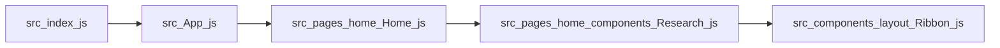
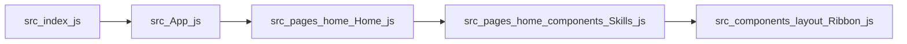
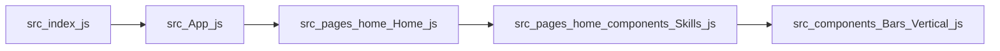

# Entry-based Execution Paths

These diagrams show individual execution paths starting from application entry points. Each path represents one possible flow through the system.

## Path 1 — `src/index.js`

**Execution chain:** src/index.js → src/App.js → src/pages/home/Home.js → src/pages/home/components/Research.js → src/components/layout/Ribbon.js

## Path 2 — `src/index.js`

**Execution chain:** src/index.js → src/App.js → src/pages/home/Home.js → src/pages/home/components/Skills.js → src/components/layout/Ribbon.js

## Path 3 — `src/index.js`

**Execution chain:** src/index.js → src/App.js → src/pages/home/Home.js → src/pages/home/components/Skills.js → src/components/Bars/Vertical.js
